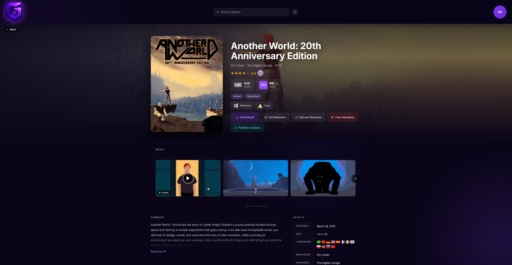
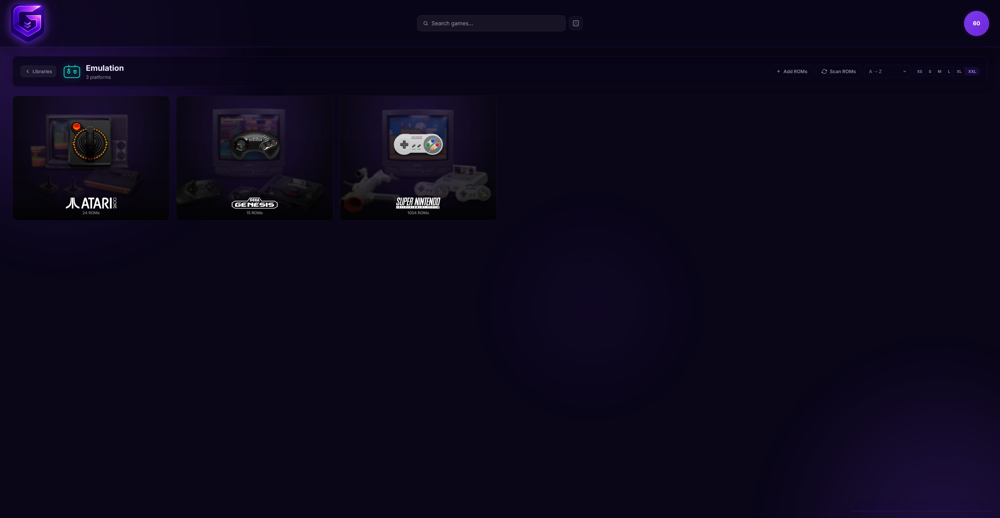
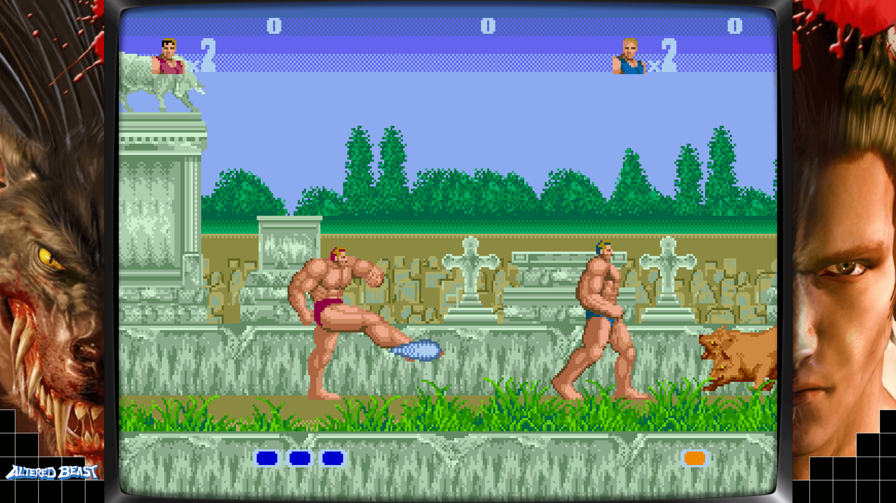
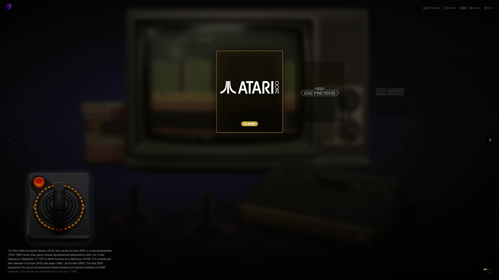
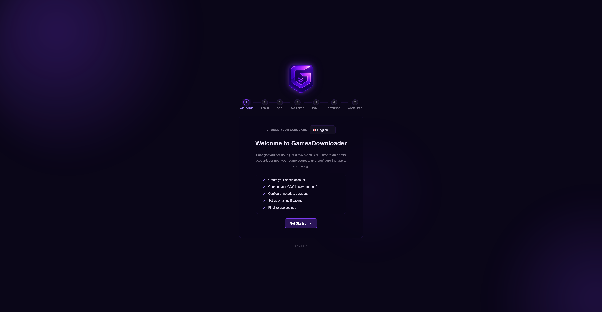
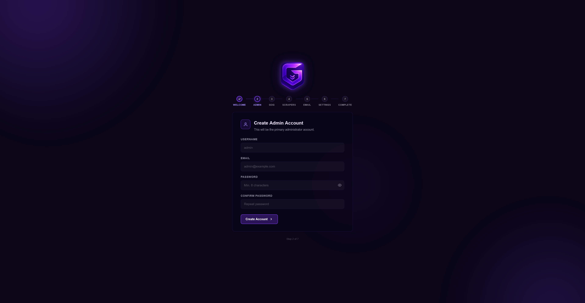
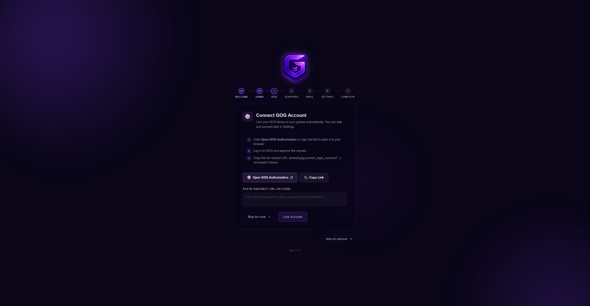
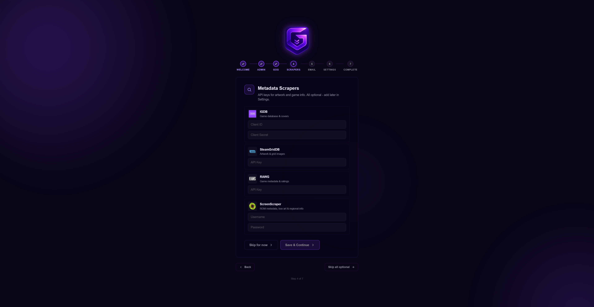
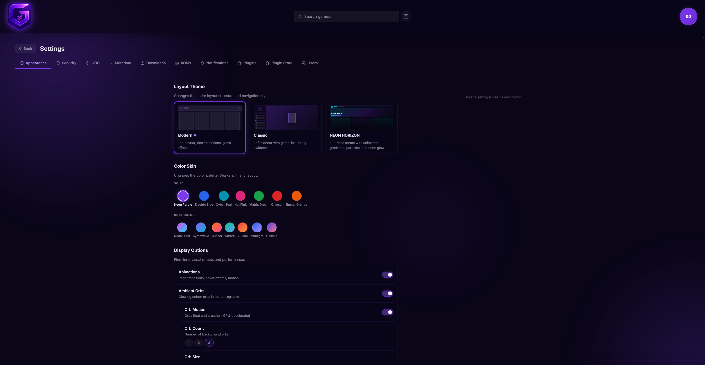

# GamesDownloader

[](https://discord.gg/Hz8BNNQrMu)
[](LICENSE)
[](LICENSE-ASSETS)

**A self-hosted game library manager born from a passion for game preservation.**

GamesDownloader lets you build and manage your personal game collection - GOG titles, custom games, ROM library - all from a clean, self-hosted web interface. Think of it as your own private game vault: browse your library, download games, play ROMs in the browser, manage metadata, and share access with family or friends on your local network.

> **Community:** [Discord server](https://discord.gg/Hz8BNNQrMu) - get help, share your library, propose features, follow releases.

---

## Why this exists

Commercial game storefronts come and go. DRM servers go offline. Publishers get acquired. Games get delisted.

GamesDownloader is a personal project built on the belief that games you own should stay yours - properly catalogued, beautifully presented, and available whenever you want them.

---

## Features

### GOG Library
- Sync your GOG account library automatically
- Direct game downloads with queue management and progress tracking
- Pause, resume, and retry downloads
- Checksum verification after download

### Metadata & Artwork
- Automatic metadata scraping from multiple sources: **GOG**, **IGDB**, **RAWG**, **Steam**, **SystemRequirementsLab**
- Artwork from **SteamGridDB** covers, hero banners, logos, icons (including animated WebP variants)
- Smart title-matching to avoid wrong-game results
- Manual override for any metadata field
- Screenshot gallery management with drag-to-reorder
- **How Long to Beat (HLTB)** playtime estimates (Main Story + 100%) displayed on game detail pages for GOG, Library, and ROM titles

### Custom Games Library
- Add any game, not just GOG titles
- Upload game files directly through the web UI with progress bar
- **Add via torrent** admins can add games to the server library using a magnet link, .torrent URL, or by uploading a .torrent file; completed downloads are moved to `data/games/CUSTOM/` and automatically registered in the library
- Organize by OS, file type (game / DLC / extra), version, and language
- Native streaming downloads, browser download manager with progress bar
- **Torrent seeding** users can download any library file as a `.torrent`; the server seeds it via Transmission until the file has been fully uploaded to at least one peer (1× ratio), then the seed expires and a new `.torrent` must be generated
- **Download speed limits** global server-wide cap and per-user overrides (configured in Settings → Downloads)
- **Download tokens** generate shareable one-time links per file; optional password protection, expiry time, and max-download limit; no account required for the recipient

### ROM Library
- Scan local ROM directories and build a full library per platform (SNES, Genesis, Game Boy, PS1, N64, and more)
- Automatic metadata scraping from **ScreenScraper**, **IGDB**, **LaunchBox**, **HowLongToBeat**, and **metadata plugins** in one pass
  - Hash-based matching (CRC32 / MD5 / SHA1 from inside archives) with filename and name-search fallback
  - Support for `.zip` and `.7z` archives - hashes computed from the ROM inside, not the archive
  - LaunchBox as full provider: covers (Box-Front, Box-3D, Fanart-Box-Front), heroes (Fanart-Background, Banner), screenshots, clear logos, descriptions, ratings, and metadata
  - LaunchBox index built as an on-disk SQLite database (persistent across restarts, ~0 RAM footprint after first build)
- Artwork: box art (front, 3D, back, spine), hero banners, screenshots, support art, wheel logos, bezels, Steam Grid art, video trailers
- Platform-aware cover aspect ratios (e.g. 3:4 modern, 1:1 Game Boy, 16:11 SNES)
- **Multi-source ratings** - IGDB (/100), LaunchBox (/10), and plugin ratings displayed as badges on game detail pages alongside ScreenScraper score (/20)
- **Video trailers** shown as the first slide in the media carousel with a Trailer badge; click to play in a modal
- **Company logos** developer and publisher displayed as ScreenScraper logos in the game hero
- **Alternative names & franchises** stored from ScreenScraper `noms[]` and `familles[]`
- **Edit Metadata panel** - 10-tab editor (Cover, Hero, Screenshots, Support, Bezel, Wheel, Steam Grid, Video, Description, Details)
  - Combined search across **SS + IGDB + LaunchBox + SteamGridDB + plugins** with icon-based source filter buttons and result counts
  - Multi-source Description and Details tabs - compare metadata from SS, IGDB, LaunchBox, and plugins side-by-side with per-source Apply buttons
  - Source badges with provider icons on all cover thumbnails
  - Sidebar with Cover/Hero/Support/Wheel previews, clickable to switch tabs
  - "Scrape this version" for ScreenScraper and LaunchBox results
  - SteamGridDB: grids -> covers, heroes -> fanarts, logos -> wheel logos, icons -> steamgrid icons
  - Box art variant picker, manual URL override, per-field editing
- **Plugin support** - metadata plugins (covers, heroes, logos, screenshots, descriptions, ratings) work for ROM library just like GOG/Games Library
- **Clear Metadata** per-ROM or per-platform reset (admin only)
- **Auto-create ROM directories** platform folders created automatically on container start

### In-Browser Emulation
- **EmulatorJS integration** play ROMs directly in the browser, no installation required
- **Multi-core support** NES, SNES, GBA, GBC, Genesis, N64, PS1, arcade, and more via RetroArch WASM cores
- **Three display modes** Fullscreen (covers entire viewport), Window (floating resizable panel), or New Tab (opens emulator in a dedicated tab)
- **Save states** save and restore game state at any point; stored server-side per ROM per user; thumbnail screenshot attached to each save
- **Battery saves (SRAM)** persistent in-game saves uploaded automatically when the game exits
- **Load state picker** browse existing save states and battery saves directly in the player; delete individual entries with controller (X button)
- **Bezel overlay** optional decorative frame (PNG with transparent center) overlaid on the game canvas; toggled per-game and remembered across sessions
- **Gamepad support** browser Gamepad API (Chromium-based browsers recommended; Firefox has limited gamepad support in embedded contexts)
- **Game Saves tab** users can view, manage, and delete their own save states and battery saves from the Profile page; quota bar shows total disk usage

### Couch Mode (Console-Style UI)
- **Full-screen, controller-first interface** browse platforms and ROMs, launch games, manage saves, all without a keyboard or mouse
- **Platform carousel** animated card carousel with Ken Burns photo backgrounds, platform name logos, and locale-aware scrolling descriptions (XML metadata in UI language with fallback)
- **Three themes** Noir, Aura, Slick with per-theme card and overlay styling
- **Game list** list and grid views with configurable cover sizes (XS/S/M/L); background video from game trailers with volume control
- **In-game pause menu** Start+Select opens a custom overlay with Resume, Save State, Load State, Emulator Settings, and Exit Game
- **Full emulator settings** 10-category custom settings system driven by the actual EJS API:
  - Audio (volume, mute)
  - Graphics (shader selection from EJS config, FPS, VSync, video rotation)
  - Screen Capture (screenshot/recording format, upscale, bitrate)
  - Speed (fast forward, slow motion, rewind with granularity)
  - Input (keyboard, mouse lock, autofire, virtual gamepad)
  - Save States (slot 1-9, location, auto-save interval)
  - Control Settings (per-player gamepad assignment, button remapping with key/gamepad capture)
  - Cheats (dynamic from loaded cheat codes)
  - Core Options (dynamic, read from the emulator core at runtime)
  - Restart Game
- **Settings persistence** all settings saved across sessions via EJS storage + custom localStorage
- **Couch Menu** (Start or M key) theme, view mode, launch mode, bezel toggle, cover size, and video volume control
- **Couch Mode accessible from Classic theme** via user menu link; exits to `/library` in Classic, `/` in Modern
- **Exit Couch Mode dialog** controller-navigable confirmation panel
- **Gamepad bleed-through prevention** 300ms cooldown after overlay closes; button presses from one panel don't leak into the view underneath

### Multi-User GOG Accounts
- **Per-user GOG accounts** any user can connect their GOG account in Profile
- User's games appear in Game Requests > My GOG tab for requesting downloads
- Admin sees all users' games in GOG Library with owner badges
- Downloads use the game owner's GOG token (not just admin's)
- Owner tracking: golden crown badge for admin games, username for user games
- Disconnect cleanup: non-downloaded games removed, published games stay
- Games Library shows original GOG owner when published from GOG
- **Metadata fallback** published GOG games reference the original GOG data directly, no duplication; custom games store their own metadata independently
- **Deduplication** when multiple users own the same GOG game, it appears once in the library (admin copy takes priority)

### Multi-User & Permissions
- Role-based access: **Admin**, **Uploader**, **Editor**, **User**
- Per-user permission overrides
- Per-game access control, restrict specific titles to specific users
- JWT-based authentication with refresh tokens and instant session revocation
- **Forgot Password** self-service password reset via email (JWT token, 1 hour expiry, rate limited)
- **Single Sign-On (SSO)** OIDC (Keycloak, Authentik, any OpenID Connect provider), Google, GitHub, Microsoft; login mode configurable as *alongside* (local + SSO) or *replace* (SSO only, local login accessible via emergency link); users matched by email then username, must exist in DB first

### UI & Themes
- Two built-in layout modes: **Modern** (card grid + list view with hero art) and **Classic** (game-detail sidebar)
  - Modern: cover grid with tilt/shine/glow effects, list view with Ken Burns hero backgrounds, alphabet sidebar
  - Classic: supports all three libraries (GOG, Custom Games, ROM/Emulation), platform switcher, steamgrid icons in sidebar
  - Hot-swap between layouts without page reload (`:key`-driven re-render)
- **Plugin theme system** theme plugins can provide complete custom Vue layouts (navbar, home page, etc.), not just color skins
  - Plugin `.vue` files are automatically compiled by Vite on container startup
  - Plugins access Vue runtime, stores, and API via `window.__GD__` bridge
  - See [gd3-plugin-template](https://github.com/60plus/gd3-plugin-template) for the NEON HORIZON example theme
- Glass-style UI throughout (backdrop-filter blur, color-mix accents, theme-aware glows); all buttons, toggles, and chips use the unified glass pattern
- Ambient background effect using game hero artwork
- 14 color skins (7 solid + 7 dual-gradient), all UI elements adapt to active skin
- Persistent view mode and sort preferences per library
- Fully responsive

### Download Statistics
- Track downloads per game and per user
- Bytes transferred, timestamps, file-level stats
- Admin dashboard

### Security
- **Two-factor authentication (2FA / TOTP)** any user can enrol an authenticator app (Google Authenticator, Authy, 1Password, etc.) from Profile > Security; QR code is rendered as a self-contained inline SVG (no third-party image service); 10 single-use recovery codes (bcrypt-hashed at rest) for the lost-device case; secret is staged in Redis until the user proves possession by submitting a valid code, never persisted speculatively
- **2FA admin recovery** when a user loses both their authenticator and their recovery codes, an admin can clear their 2FA from the Users panel; both the user (if they have an email on file) and the admin alert pool receive an email notification, and the action is recorded in the audit log with actor and target
- **Avatars are upload-only** profile pictures are accepted only via direct file upload, with a path-traversal guard against the avatars directory; the GOG-derived avatar flow stores the locally-downloaded file path, never an external URL, eliminating the open-redirect / SSRF surface that the previous redirect-based handler exposed
- **Single-use password-reset links** the jti of every consumed reset token is added to a Redis blacklist for the rest of its 1 h validity, so the same email link cannot be replayed after a successful reset
- **Brute-force protection**Redis-based fixed-window rate limiting per IP with configurable thresholds, ban duration, and whitelist; safe real-IP extraction behind Cloudflare, nginx, or direct access (applied to login, register, and token refresh endpoints)
- **Security headers**`X-Content-Type-Options`, `X-Frame-Options`, `Referrer-Policy`, `X-XSS-Protection` sent on every response
- **IP allowlist** optionally restrict access to specific IPs or CIDR ranges; Cloudflare-aware
- **Network access control** configurable CORS origins, trusted proxy list, dynamic (no restart needed)
- **Registration modes** open, disabled, or invite-only (time-limited invite codes with use limits)
- **Session management** all active sessions visible in the admin Users panel; instant per-session or global revoke; Redis JTI blocklist with DB fallback
- **Email security alerts** configurable email notifications for: failed login attempts, logins from new IP addresses, new user registrations, admin privilege grants, and brute-force IP bans; per-event toggles; Redis deduplication; uses shared Notifications SMTP
- **Security report** periodic summary email (weekly or monthly) covering login activity, downloads, ClamAV scan results, new users, and most active users; live preview in the UI; manual send button
- **Audit log** rolling log of security events (login, ban, unban) with filter and pagination; managed from the admin UI
- **ClamAV antivirus** integrated in the same container; manual scans of GOG, Custom, and Downloads folders; opt-in upload scanning that quarantines or deletes infected files at write time (library uploads, ROM uploads, savestates, battery saves); real-time progress via Socket.IO; virus definition updates via freshclam; scan history stored in DB
- **Authenticated WebSockets** Socket.IO handshake requires a valid Bearer JWT; per-user and per-role rooms so download / scan progress events reach only the originating user or admin
- **Upload guard** streaming uploads aborted and file deleted if they exceed the configured `max_upload_bytes` limit (default 50 GB)
- **Metadata field whitelist**ROM metadata updates restricted to safe fields; immutable fields (`id`, `platform_id`, filesystem paths) cannot be overwritten via API

### Plugin System
- **ZIP-based installation** upload a plugin ZIP via Settings > Plugins, dependencies installed automatically
- **6 plugin types** metadata scrapers, download providers, library sources, themes, widgets, lifecycle hooks
- **Metadata plugins work across all libraries** - GOG, Games Library, and ROM Library all call plugin hooks for covers, heroes, logos, screenshots, descriptions, and ratings
- **Theme plugins** can provide Vue SFC layouts (`.vue` files), automatically compiled on container startup via Vite; full custom layouts, not just color overrides
- **Plugin Store** browse and install plugins from configurable store sources; update detection with changelog preview and version transition display; container restart button for theme plugins; notification badge on user avatar when updates available; screenshot gallery with fullscreen lightbox and navigation
- **Notification system** general-purpose badge on user avatar; plugins can push their own notifications via `window.__GD__.notifications.add()`
- **Plugin management UI** install, enable/disable, configure, and uninstall from the browser
- **Plugin config** per-plugin settings rendered as forms (boolean, string, number, select fields)
- **Plugin i18n** plugins deliver their own translations via `i18n.json`, merged at runtime; no hardcoded plugin strings in the main app
- **Available plugins** (installed separately via [Plugin Store](https://github.com/60plus/gd3-plugin-store)):
  - **NEON HORIZON Theme** - futuristic Netflix-style layout with hero banner, library tabs, particles, 8 color skins, Colorful Pop couch mode
  - **TheGamesDB Scraper** - covers, heroes, logos from TheGamesDB.net community database
  - **PPE.pl Metadata Scraper** - Polish game descriptions, ratings, screenshot galleries
  - **Description Translator** - translate game descriptions between 26 languages (Google Translate, no API key)
- **Plugin development** [gd3-plugin-template](https://github.com/60plus/gd3-plugin-template) with starter templates, working examples, and hook reference

### Internationalization (i18n)
- **8 languages**: English, Polish (hand-crafted), German, French, Spanish, Portuguese (BR), Russian, Italian (auto-translated, 1300+ keys each)
- **Flag icons via SVG sprite (`flag-icons`)** language indicators throughout the UI - Profile picker, Setup wizard, GOG / Games / Classic detail pages - render the same crisp glyph on every OS. The previous Unicode regional-indicator emoji (`🇩🇪`, `🇫🇷`, ...) showed as bare two-letter codes on Windows Chrome / Edge because Windows ships no flag font; the sprite eliminates that gap.
- Language selector in Profile and the setup wizard's first step is a custom dropdown (teleported popover so an `overflow: hidden` ancestor cannot clip it; outside-click closes it cleanly without eating the item click).
- All Settings pages, libraries, detail pages, dialogs, metadata editors, Profile (incl. the full GOG-connect walkthrough and the connected-account panel), Couch Mode, theme settings translated
- Plugin i18n: plugins deliver translations via `i18n.json`, auto-merged on startup via `/api/plugins/frontend/i18n`
- Locale-aware date formatting throughout the UI
- Language detection from browser with localStorage persistence

> **Note:** DE, FR, ES, PT, RU, IT translations were auto-generated BY AI. Community corrections welcome.

### Game Requests
- Users can request games they want added to the library
- Vote system for prioritizing requests
- Admin approval workflow (pending, approved, rejected, done)
- Per-request notes visible to all users
- Platform filter (Games / Emulation)
- GOG library quick-request tab

### Smart Home Search
- **One search box, every library** the navbar input on Home queries emulation ROMs, GOG games and the local Games Library at once and renders the hits grouped by source, so finding a title across hundreds of platforms takes a single keystroke instead of opening each library separately
- **Server-side, paginated, debounced** queries hit `/api/search/global` with a 280 ms debounce and an AbortController so in-flight requests are cancelled while the user keeps typing; each bucket is capped at 50 hits independently so a generic word cannot crowd one library out of the others
- **Per-library views unchanged** EmulationLibrary, GogLibrary and GamesLibrary keep their dedicated single-scope search boxes for users who already know which library they want to drill into
- **Privacy aware** the GOG bucket is admin-only - mirroring the Home GOG card - so a non-admin token cannot enumerate the admin's private GOG list through the global endpoint
- **Short queries skipped** queries below 2 characters return empty buckets so the database is not scanned while the user is still typing the first letter

### Backup & Restore
- **Metadata backup** Settings > Metadata > Download backup builds a single ZIP containing JSON dumps of every scraped table (GOG games, Library games, ROMs, ROM platforms, Library files, Library torrents, plugin config, game requests)
- **Media bundle (opt-in, on by default)** every cover, background, logo, icon, screenshot, support art, wheel, bezel, steamgrid, video and picto referenced by the metadata is added to the archive; preview shows total media count and size before download
- **Settings bundle (opt-in, off by default)** includes scraper API keys, SMTP, webhook URL + avatar + all message templates, OAuth/SSO secrets, brute-force config, IP allowlist, ClamAV settings, Transmission, plugin store sources, registration mode, alert recipients and report schedule; values stay encrypted with the server `AUTH_SECRET_KEY` so the archive is portable only between installs that share the same key
- **Streaming archive** ZIP is built into a temp file and served via `FileResponse` with a background cleanup task so multi-GB libraries do not blow RAM
- **Restore** upload a backup ZIP and pick which slices to apply (metadata / media / settings); table rows are upserted by their natural keys (`gog_id`, `igdb_id+slug`, `fs_slug`, `platform_id+fs_path`, `plugin_id+key`) so re-running on the same install never touches primary key `id`
- **Path safety** media extraction guards against `..` and absolute paths; only writes under `BASE_PATH`

### Accessibility
- **`prefers-reduced-motion`** honoured globally - ambient orbs, Ken Burns hero, carousel, and other heavy CSS animations stop when the operating system or browser asks for reduced motion; `useReducedMotion()` composable available for JS-driven animations
- **Keyboard focus rings** visible on every interactive element via `:focus-visible` (WCAG 2.1 SC 2.4.7)
- **Animation kill-switch** `[data-animations="false"]` toggle for users who want to stop motion regardless of OS settings

### Performance
- **Conditional GET via ETag** authenticated `/api/` GET responses ship a weak `ETag` (blake2b of the body) and `Cache-Control: private, max-age=0, must-revalidate`; when the browser returns with `If-None-Match`, the server short-circuits with `304 Not Modified` and an empty body. Lists stay fresh on every interaction while unchanged payloads cost a single RTT instead of a full JSON transfer
- **Auth user lookup cached in Redis** the bearer-token middleware used to fire `SELECT ... FROM users WHERE username = ?` on every authenticated request - one library page rendering 50 covers multiplied that into 50 round-trips to MariaDB. A 60 s Redis snapshot per username collapses that to one hit per minute; user updates (role, disable, password, TOTP) invalidate the snapshot for both the old and new username so changes propagate immediately
- **Cache failures fall through** Redis errors and cache misses always fall back to a real DB query so the application keeps working when the cache is unreachable
- **Layout-stable scroll containers** library and settings panels reserve their scrollbar gutter via `scrollbar-gutter: stable`, so paginating, filtering, or switching tabs no longer reflows the cover grid sideways by ~15 px when the scrollbar appears or disappears

### Operations
- **Container healthchecks** the app, MariaDB and Redis services all expose Docker healthchecks; the orchestrator marks them `(healthy)` only after `/api/health` returns 200 (with a 120 s `start_period` to absorb the LaunchBox metadata download on first boot), MariaDB answers `SELECT 1`, and Valkey answers `PING`. The app's `depends_on` waits for both data services to be `service_healthy` so startup never races against a still-loading DB or cache.

### CI
- **GitHub Actions lint workflow** runs on every push to `main` and every pull request: `ruff` for the Python backend, `vue-tsc --noEmit` for the frontend type-check, and a JSON-syntax pass over all `frontend/src/i18n/*.json` files. Failures show up as red checks on the public repo so contributors see the issue before review; the workflow is GitHub-side only and does not block deployment, which pulls from a separate Gitea remote

### Other
- 7-step setup wizard for first-run configuration
- SMTP email configuration with test
- Webhook notifications (Discord rich embeds, generic JSON)
- Real-time events via Socket.IO (sync progress, download progress, scan progress, antivirus progress)
- **Cloud save auto-sync (opt-in)** for the in-browser emulator: Settings > ROMs toggle uploads battery saves to the server every 30/60/120/300 s while you play, content-hashed so unchanged saves do not waste storage
- GOG metadata fallback for published games (zero data duplication)
- Library media handler downloads external images to server for offline serving
- Random Game picker with library/platform/genre/file filters

---

## Tech Stack

| Layer | Technology |
|---|---|
| Backend | Python · FastAPI · SQLAlchemy · asyncio |
| Frontend | Vue 3 · Vite · Pinia · Vuetify · custom CSS |
| Emulation | EmulatorJS (local-first, CDN fallback) · RetroArch cores via WebAssembly |
| Database | MariaDB |
| Cache / Queue | Redis (Valkey) |
| Real-time | Socket.IO |
| Antivirus | ClamAV (clamd + freshclam, in-container) |
| Torrent | Transmission (daemon + CLI, in-container) |
| Plugins | pluggy |
| Deployment | Docker · Docker Compose |

---

## Quick Start

```bash
git clone https://github.com/60plus/GamesDownloader.git
cd GamesDownloader
cp .env.example .env
# Edit .env with your settings
docker compose up -d
```

Open `http://localhost:8080` - the setup wizard will guide you through initial configuration.

> **First run:** After the container starts, go to **Settings → Security → ClamAV** and click **Update Definitions** to download the virus database (~300 MB). The ClamAV daemon will start automatically once definitions are available.

> **Transmission:** The Transmission daemon starts automatically inside the container. Enable it in **Settings → Downloads → Transmission** and expose ports `9091` (WebUI) and `51413` (peers) in your firewall if needed.

> **ROMs:** Place ROM files in `GD_BASE_DIR/data/games/roms/{platform}/` (e.g. `roms/snes/`, `roms/n64/`). Then use the **Scan ROMs** button in the Emulation library to register them.

---

## Configuration

Copy `.env.example` to `.env` and fill in:

```env
# Database
DB_NAME=gamesdownloader
DB_USER=gd
DB_PASSWD=your-password

# Auth (use a long random string, min 32 chars).
# If left as the placeholder "change-me-in-production", the entrypoint
# auto-generates a 256-bit key on first start and persists it to
# /data/.secret_key. Keep that file safe: losing it invalidates every
# active session and makes secrets in app_config unreadable.
GD_AUTH_SECRET_KEY=your-very-long-random-secret-key

# Base path for all data on the host machine
GD_BASE_DIR=/path/to/your/data

# Optional API keys (for metadata scraping)
IGDB_CLIENT_ID=
IGDB_CLIENT_SECRET=
RAWG_API_KEY=
STEAMGRIDDB_API_KEY=
SCREENSCRAPER_USER=
SCREENSCRAPER_PASSWORD=
```

API keys can also be configured after first login in **Settings → Metadata**.

---

## Data Volumes

All persistent data lives under `GD_BASE_DIR` on the host:

| Path | Contents |
|---|---|
| `data/games/GOG` | Published GOG game files |
| `data/games/CUSTOM` | Custom game files (uploaded, torrent, scanned) |
| `data/games/roms/{platform}` | ROM files per platform |
| `data/downloads` | GOG downloaded installers (pre-publish staging) |
| `data/downloads/torrents` | Torrent download staging area |
| `data/resources/gog/{gog_id}` | GOG game media (covers, backgrounds, screenshots, logos, icons) |
| `data/resources/library/{game_id}` | Custom Games library media (downloaded from external scrapers) |
| `data/resources/roms/{platform}/{rom_id}` | Per-ROM media (cover, hero, bezel, wheel, video, support art) |
| `data/resources/roms/{platform}/{rom_id}/states/{user_id}` | Save states per user per ROM |
| `data/resources/roms/{platform}/{rom_id}/saves/{user_id}` | Battery saves (SRAM) per user per ROM |
| `data/resources/avatars` | User profile pictures |
| `data/resources/platforms` | Platform icons, name logos, fanart |
| `data/config` | App configuration (settings.yaml) |
| `data/config/launchbox_cache` | LaunchBox SQLite index (built once, reused across restarts) |
| `data/config/transmission` | Transmission daemon config and logs |
| `data/config/torrents` | Generated .torrent files for library seeding |
| `data/plugins` | Installed plugins (each in its own subdirectory) |
| `data/clamav` | ClamAV virus definitions (~300 MB) |
| `data/db` | MariaDB data files |
| `data/redis` | Redis/Valkey persistence |

---

## Metadata Sources

### GOG / Custom Games Library

| Source | Covers | Backgrounds | Logos | Description | Requirements | Rating | Playtime |
|---|:---:|:---:|:---:|:---:|:---:|:---:|:---:|
| GOG | ✓ | ✓ | ✓ | ✓ | ✓ | ✓ ||
| SteamGridDB | ✓ | ✓ | ✓ |||||
| IGDB | ✓ ||| ✓ || ✓ ||
| RAWG || ✓ || ✓ || ✓ ||
| Steam ||||| ✓ | ✓ ||
| SystemRequirementsLab ||||| ✓ |||
| HowLongToBeat ||||||| ✓ |

### ROM Library

| Source | Cover | Hero | Screenshots | Support / Bezel / Wheel | Steam Grid | Video | Description | Score | Playtime |
|---|:---:|:---:|:---:|:---:|:---:|:---:|:---:|:---:|:---:|
| ScreenScraper | ✓ | ✓ | ✓ | ✓ || ✓ | ✓ | ✓ ||
| IGDB | ✓ || ✓ |||| ✓ | ✓ ||
| LaunchBox | ✓ | ✓ | ✓ | ✓ ||| ✓ | ✓ ||
| SteamGridDB | ✓ | ✓ || ✓ | ✓ |||||
| Plugins | ✓ | ✓ | ✓ | ✓ ||| ✓ | ✓ ||
| HowLongToBeat ||||||||| ✓ |

---

## Screenshots

### Home & GOG Library

| | |
|---|---|
|  |  |
| Home - library cards with ambient hero backgrounds | GOG Library - grid view with cover artwork |
|  |  |
| GOG Library - list view with meta, ratings, hero banners | Game detail with cinematic hero, ratings, actions |

### Emulation Library

| | |
|---|---|
|  |  |
| Platform select with fanart-driven cards | ROM library - cover grid with hero header |
|  |  |
| ROM detail with metadata, screenshots, save states | In-browser emulation via EmulatorJS |

### Couch Mode (controller-first full-screen UI)

| | |
|---|---|
|  |  |
| Platform carousel - Colorful Pop styled | Game carousel with fanart background |

### Setup Wizard (first-run, 8-language picker, no shell access required)

| | |
|---|---|
|  |  |
| Step 1 - Welcome with language picker | Step 2 - Create admin account |
|  |  |
| Step 3 - GOG account connect | Step 4 - Metadata scrapers (IGDB, RAWG, ScreenScraper, SteamGridDB, LaunchBox) |

### Theming

| |
|---|
|  |
| Settings - Appearance: 12 colour skins, layout swap, animation controls, plugin themes |

---

## Roadmap

- [x] **Couch Mode** full-screen, controller-navigable UI
- [x] **Plugin System** ZIP install, Settings UI, metadata/theme/widget hooks, template repo
- [x] **Multi-user GOG** per-user GOG accounts, owner tracking, My GOG tab
- [x] **Forgot Password** self-service reset via email
- [x] **Webhook templates** per-status message templates with live preview
- [ ] **RetroAchievements** track ROM achievements server-side; blocked on the official RetroArch Emscripten build lacking `HAVE_CHEEVOS`; requires a custom WASM rebuild
- [x] **Theme plugins** Vue SFC compilation on startup, `window.__GD__` bridge, NEON HORIZON example
- [x] **i18n** full English + Polish + 6 auto-translated languages, plugin translation support, locale-aware dates, theme settings i18n
- [x] **Game Requests** vote-based request system with admin approval workflow
- [x] **GOG metadata fallback** published games reference GOG data directly, zero duplication
- [ ] Mobile-friendly layout improvements
- [x] **Additional languages** DE, FR, ES, PT, RU, IT (auto-translated)

---

## Credits & Acknowledgments

GamesDownloader V3 was inspired by several outstanding open-source projects:

- **[RomM](https://github.com/rommapp/romm)** - ROM management platform that inspired the emulation library architecture, metadata scraping approach, and platform organisation.
- **[Gameyfin](https://github.com/grimsi/gameyfin)** - self-hosted game library manager that inspired the original concept of a personal game vault with automatic metadata fetching.

**Platform artwork** (`frontend/public/platforms/*`) comes from EmulationStation community themes by **RobZombie9043**:

- **Colorful Pop** - platform icons, SVG name logos, fanart backgrounds, 15-language platform metadata, system colour palettes.
- **Elementerial** - additional design inspiration.

These assets are used under their original **CC BY-NC-SA 4.0** licence - see [`LICENSE-ASSETS`](./LICENSE-ASSETS) and [`NOTICE.md`](./NOTICE.md).  All credit for the original artwork goes to RobZombie9043.

Special thanks to the teams behind **EmulatorJS**, **ScreenScraper**, **SteamGridDB**, **LaunchBox**, **HowLongToBeat**, **IGDB**, **RAWG**, and the dozens of open-source projects this codebase stands on.

---

## License

This project uses a dual-licensing scheme:

| Scope | Licence | File |
|---|---|---|
| Source code (backend + frontend + plugins) | **GNU AGPL-3.0** | [`LICENSE`](./LICENSE) |
| Platform artwork (`frontend/public/platforms/*`) | **CC BY-NC-SA 4.0** | [`LICENSE-ASSETS`](./LICENSE-ASSETS) |
| Third-party service icons (GOG, IGDB, RAWG, Steam, etc.) | trademarks of their respective owners, nominative use | [`NOTICE.md`](./NOTICE.md) |

**In practice:**

- Self-host, fork, modify, share with friends: **fully permitted**.
- Run a modified version as a public network service: you **must** release your changes under AGPL-3.0 (the copyleft server-side clause).
- Offer as a **paid SaaS** while bundling the platform artwork: **not permitted** (the NC clause applies to the CC BY-NC-SA assets).  To run commercially, remove `frontend/public/platforms/` and source compatible-licence artwork.
- Attribution to RobZombie9043 must be preserved in any redistribution - see [`NOTICE.md`](./NOTICE.md).

Not affiliated with GOG, Valve, Nintendo, Sony, Microsoft, Sega, CD PROJEKT, ScreenScraper, LaunchBox, EmulatorJS, or any other platform or service.  All trademarks are property of their respective owners.
