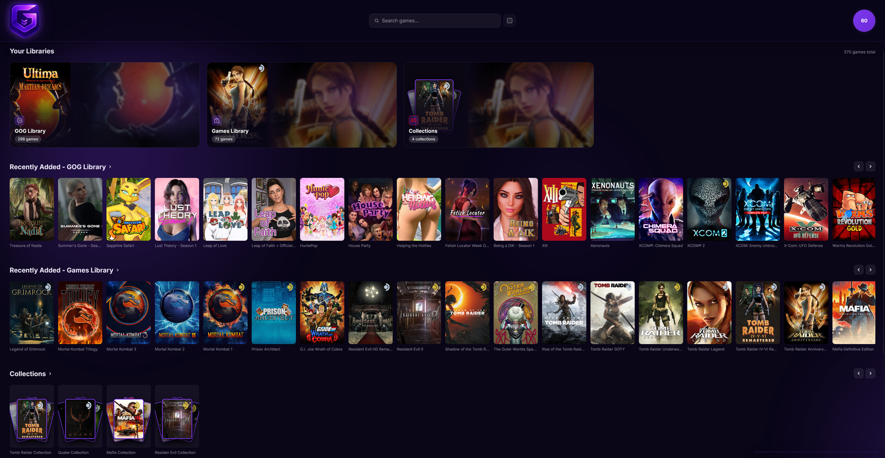
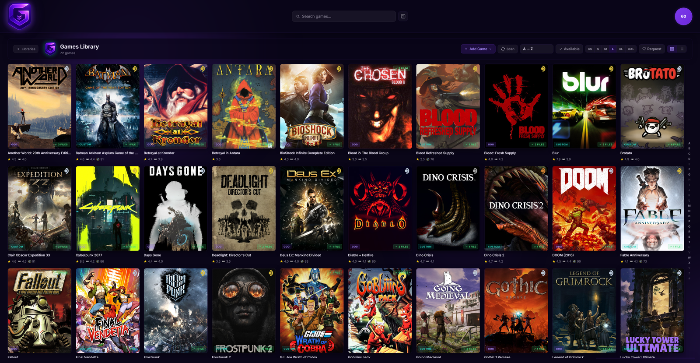
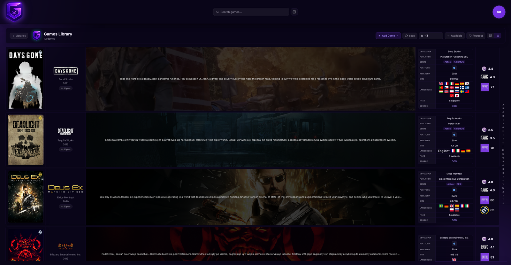
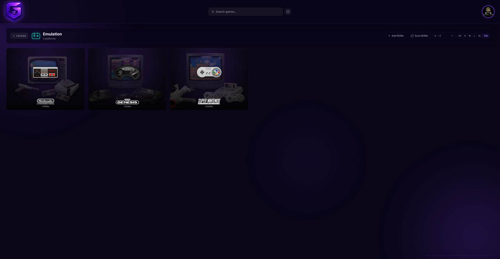
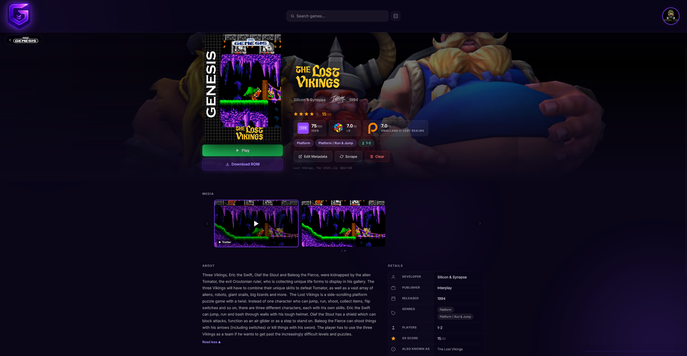
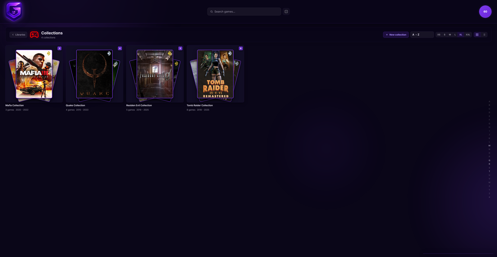
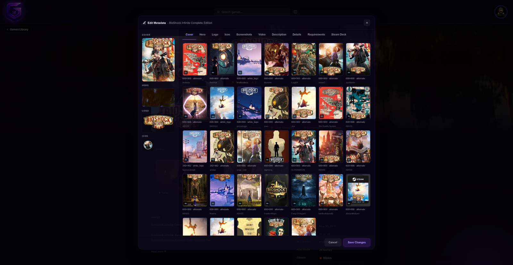
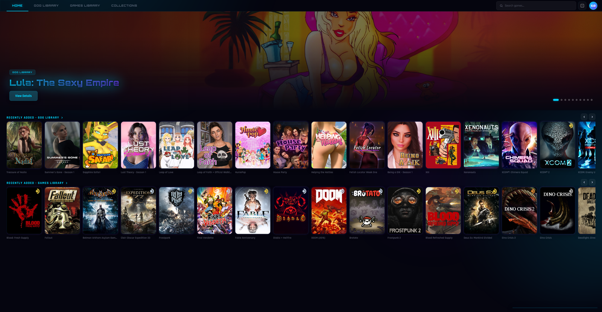
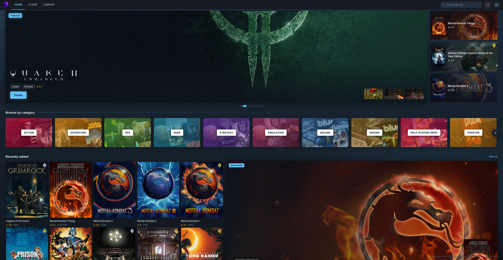

# GamesDownloader

[](https://discord.gg/Hz8BNNQrMu)
[](https://github.com/60plus/GamesDownloader/wiki)
[](LICENSE)
[](LICENSE-ASSETS)

**A self-hosted game library manager born from a passion for game preservation.**

GamesDownloader is your own private game vault: build and manage a personal collection of GOG titles, custom games, and a full ROM library, browse it through a clean web interface, play retro games straight in the browser, and share access with family or friends on your network.



> **Get started:** [Installation guide](https://github.com/60plus/GamesDownloader/wiki/Installation) · **Full docs:** [Wiki](https://github.com/60plus/GamesDownloader/wiki) · **Community:** [Discord](https://discord.gg/Hz8BNNQrMu)

---

## Why this exists

Commercial game storefronts come and go. DRM servers go offline. Publishers get acquired. Games get delisted.

GamesDownloader is a personal project built on the belief that games you own should stay yours: properly catalogued, beautifully presented, and available whenever you want them. It runs happily LAN-only with no domain or proxy, and scales up to a hardened, internet-facing instance when you want one.

---

## Screenshots

| | |
|---|---|
|  |  |
| Cover grid with tilt and glow | List view with cinematic hero art |
|  |  |
| Platform select with fanart cards | ROM detail with metadata and artwork |
|  |  |
| Curated collections on the home screen | Multi-source metadata editor |

---

## Features at a glance

Every area below has a dedicated page in the [Wiki](https://github.com/60plus/GamesDownloader/wiki) with the full detail.

### Libraries
- **GOG** account sync with queued downloads, pause/resume/retry, checksum verification, and per-platform packaging. Multi-user: everyone can connect their own GOG account, with owner tracking and deduplication.
- **Custom games** uploaded through the browser (a local file or a direct URL) or added by magnet / `.torrent`, each landing in whichever library you are viewing, organised by OS, type, version, and language.
- **ROM library** scanned per platform, matched by hash (CRC32 / MD5 / SHA1 from inside `.zip` / `.7z`) for spot-on results.
- **Collections** that cut across all of it: hand-picked shelves with their own cover, hero and description, scraped like any other title, sitting as tiles on the home screen. A collection can hold a game from any library, and it can hold other collections.
- **Catalogues you can browse** rather than only files you own: a plugin can put a storefront beside your libraries, or a **ROM source** in front of a remote archive, and what you pick lands in the right folder and is scanned and scraped like anything you copied in yourself.
- Full detail: [Library](https://github.com/60plus/GamesDownloader/wiki/Library) · [Collections](https://github.com/60plus/GamesDownloader/wiki/Collections) · [GOG Integration](https://github.com/60plus/GamesDownloader/wiki/GOG-Integration) · [ROMs & Emulation](https://github.com/60plus/GamesDownloader/wiki/ROMs-and-Emulation)

### In-browser emulation
- Play ROMs directly in the browser via **EmulatorJS** (NES, SNES, GBA, Genesis, N64, PS1, arcade, and more), with nine screenshotted save-state slots, bezels, and gamepad support.
- **Your memory card travels with you.** The card a game writes to is kept on the server as you play and put into whatever browser you sign in from next, so a save made at the desk is there on the laptop. The card already in a browser is never overwritten, and one button takes it out again.
- **Firmware where the cores want it**: BIOS files live in settings, per console, and are handed to the emulator when a game starts.
- **The Amiga is a real Amiga.** Kickstart handling, **WHDLoad hard-drive installs**, and a multi-floppy title as one library entry with disk swapping from the pause menu. It saves the way an Amiga saves, to a disk rather than to a battery, and that disk is kept for you and put back wherever you play next, exactly as a memory card is.
- **Couch Mode**: a full-screen, controller-first console UI with a platform carousel and a complete emulator settings system.
- Full detail: [ROMs & Emulation](https://github.com/60plus/GamesDownloader/wiki/ROMs-and-Emulation)

### Dashboard
- A role-aware overview screen. Every user gets a personal **Your activity** panel (downloads, game saves with a per-user quota, requests, continue-playing), and admins additionally get a live **Server overview** - a real-time transfer queue, a server-health heartbeat, download and email stats, top titles and platforms, security, antivirus, and disk - all gated on the server, not just hidden.
- Full detail: [Dashboard](https://github.com/60plus/GamesDownloader/wiki/Dashboard)

### Metadata and artwork
- One-pass scraping from **IGDB, RAWG, ScreenScraper, SteamGridDB, LaunchBox, HowLongToBeat**, and metadata plugins, merged across sources.
- A ten-tab **Edit Metadata** panel with combined multi-source search and per-field overrides. All scraped media is downloaded and served locally, never hot-linked.
- Full detail: [Scrapers & Metadata](https://github.com/60plus/GamesDownloader/wiki/Scrapers-and-Metadata)

### Multi-user and security
- Role-based access (Admin / Uploader / Editor / User), per-game access control, JWT sessions with instant revocation, and SSO (OIDC, Google, GitHub, Microsoft).
- Brute-force protection, IP allowlist, trusted-proxy real-IP handling, two-factor auth, ClamAV antivirus, encrypted-at-rest secrets, audit log, and email security alerts.
- Full detail: [Network & Security](https://github.com/60plus/GamesDownloader/wiki/Network-and-Security) · [Users & Permissions](https://github.com/60plus/GamesDownloader/wiki/Users-and-Permissions) · [Security](https://github.com/60plus/GamesDownloader/wiki/Security)

### Sharing
- Shareable one-time **download tokens** (optional password, expiry, and download limit, no account needed) and **torrent seeding** of any library file via the built-in Transmission daemon.
- Full detail: [Downloads & Sharing](https://github.com/60plus/GamesDownloader/wiki/Downloads-and-Torrents)

### Notifications
- **Recently-added** announcements in the spirit of Plex/Tautulli: a rich Discord card per title, plus email as an immediate alert or a scheduled **daily / weekly digest** with a branded two-per-row layout (Games / GOG / ROMs), per-user opt-in, and delivery only to people who can actually see each item.
- Webhook and email for **GOG library sync** and **game requests** (to admins, with the decision going back to the requester), alongside the security alerts and periodic report.
- Full detail: [Email & Notifications](https://github.com/60plus/GamesDownloader/wiki/Email-and-Notifications)

### Extensible
- A **plugin system** (metadata scrapers, download providers, library sources, widgets, lifecycle hooks) and full **theme plugins** that ship complete custom Vue layouts, installable from a plugin store.
- Full detail: [Plugin Development](https://github.com/60plus/GamesDownloader/wiki/Plugin-Development)

---

## Looks and themes

Two built-in layouts, **Modern** (cover grid, list view, alphabet sidebar) and **Classic** (game-detail sidebar), plus 14 colour skins and a glass UI. Hot-swap between them with no reload.

Theme **plugins** go further and replace the whole layout. Two examples:

| Neon Horizon | Vapor |
|---|---|
|  |  |
| Netflix-style hero and tabs | Storefront look in the spirit of the big launchers |

More on the [Themes](https://github.com/60plus/GamesDownloader/wiki/Themes) page.

---

## Quick start

```bash
# Create a folder, drop in the docker-compose.yml and .env from the wiki, then:
docker compose pull
docker compose up -d
```

Open `http://localhost:8080` and the setup wizard guides you through the rest. The prebuilt multi-arch image (`linux/amd64` and `linux/arm64`) is on [Docker Hub](https://hub.docker.com/r/60plus/gamesdownloader) as `60plus/gamesdownloader`.

The [Installation guide](https://github.com/60plus/GamesDownloader/wiki/Installation) has the complete `docker-compose.yml`, a ready-to-edit `.env`, and everything about first boot, updating, and running behind a reverse proxy.

---

## Documentation

The full manual lives in the **[Wiki](https://github.com/60plus/GamesDownloader/wiki)**:

- [Installation](https://github.com/60plus/GamesDownloader/wiki/Installation) and [Reverse Proxy & HTTPS](https://github.com/60plus/GamesDownloader/wiki/Reverse-Proxy-and-HTTPS)
- [Configuration](https://github.com/60plus/GamesDownloader/wiki/Configuration), [Scrapers & Metadata](https://github.com/60plus/GamesDownloader/wiki/Scrapers-and-Metadata), [Email & Notifications](https://github.com/60plus/GamesDownloader/wiki/Email-and-Notifications), [Network & Security](https://github.com/60plus/GamesDownloader/wiki/Network-and-Security)
- Features: [Dashboard](https://github.com/60plus/GamesDownloader/wiki/Dashboard), [Library](https://github.com/60plus/GamesDownloader/wiki/Library), [Collections](https://github.com/60plus/GamesDownloader/wiki/Collections), [GOG Integration](https://github.com/60plus/GamesDownloader/wiki/GOG-Integration), [ROMs & Emulation](https://github.com/60plus/GamesDownloader/wiki/ROMs-and-Emulation), [Downloads & Sharing](https://github.com/60plus/GamesDownloader/wiki/Downloads-and-Torrents), [Users & Permissions](https://github.com/60plus/GamesDownloader/wiki/Users-and-Permissions), [Themes](https://github.com/60plus/GamesDownloader/wiki/Themes)
- [Plugin Development](https://github.com/60plus/GamesDownloader/wiki/Plugin-Development) and the [Plugin Trust Model](https://github.com/60plus/GamesDownloader/wiki/Plugin-Trust-Model)
- [Troubleshooting & FAQ](https://github.com/60plus/GamesDownloader/wiki/Troubleshooting-and-FAQ)

---

## Tech stack

| Layer | Technology |
|---|---|
| Backend | Python · FastAPI · SQLAlchemy · asyncio |
| Frontend | Vue 3 · Vite · Pinia · Vuetify · custom CSS |
| Emulation | EmulatorJS (local-first) · RetroArch cores via WebAssembly |
| Database | MariaDB |
| Cache / Queue | Redis (Valkey) |
| Real-time | Socket.IO |
| Antivirus | ClamAV (in-container) |
| Torrent | Transmission (in-container) |
| Plugins | pluggy |
| Deployment | Docker · Docker Compose |

---

## Credits and acknowledgments

GamesDownloader was inspired by several outstanding open-source projects, notably **[RomM](https://github.com/rommapp/romm)** (emulation library architecture and metadata approach) and **[Gameyfin](https://github.com/grimsi/gameyfin)** (the personal game vault concept).

Platform artwork (`frontend/public/platforms/*`) comes from EmulationStation community themes by **RobZombie9043** (Colorful Pop, Elementerial), used under **CC BY-NC-SA 4.0**. See [`LICENSE-ASSETS`](./LICENSE-ASSETS) and [`NOTICE.md`](./NOTICE.md). All credit for the original artwork goes to RobZombie9043.

Thanks also to the teams behind EmulatorJS, ScreenScraper, SteamGridDB, LaunchBox, HowLongToBeat, IGDB, RAWG, and the many open-source projects this codebase stands on.

---

## License

This project uses a dual-licensing scheme:

| Scope | Licence | File |
|---|---|---|
| Source code (backend + frontend + plugins) | **GNU AGPL-3.0** | [`LICENSE`](./LICENSE) |
| Platform artwork (`frontend/public/platforms/*`) | **CC BY-NC-SA 4.0** | [`LICENSE-ASSETS`](./LICENSE-ASSETS) |
| Third-party service icons (GOG, IGDB, RAWG, Steam, etc.) | trademarks of their respective owners, nominative use | [`NOTICE.md`](./NOTICE.md) |

**In practice:**

- Self-host, fork, modify, share with friends: **fully permitted**.
- Run a modified version as a public network service: you **must** release your changes under AGPL-3.0 (the copyleft server-side clause).
- Offer as a **paid SaaS** while bundling the platform artwork: **not permitted** (the NC clause applies to the CC BY-NC-SA assets). To run commercially, remove `frontend/public/platforms/` and source compatible-licence artwork.
- Attribution to RobZombie9043 must be preserved in any redistribution, see [`NOTICE.md`](./NOTICE.md).

Not affiliated with GOG, Valve, Nintendo, Sony, Microsoft, Sega, CD PROJEKT, ScreenScraper, LaunchBox, EmulatorJS, or any other platform or service. All trademarks are property of their respective owners.
